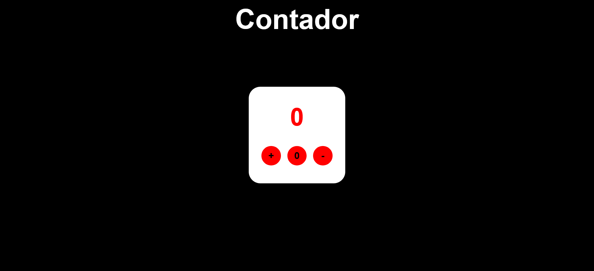

# 🔢 Number Counter React

Um contador de números de 0 a 10, feito com a biblioteca React JavaScript.

## 📚 Tabela de Conteúdos

- [🔢 Number Counter React](#-number-counter-react)
  - [📚 Tabela de Conteúdos](#-tabela-de-conteúdos)
  - [📋 Descrição](#-descrição)
    - [🚀 Funcionalidades](#-funcionalidades)
    - [🌐 Acesso](#-acesso)
    - [📸 Prévia](#-prévia)
  - [⚙️ Construção](#️-construção)
    - [💻 Tecnologias](#-tecnologias)
    - [🛠️ Ferramentas](#️-ferramentas)
    - [📌 Versão](#-versão)
  - [✏️ Aprendizado](#️-aprendizado)
  - [✒️ Autores](#️-autores)
  - [🎁 Agradecimentos](#-agradecimentos)
  - [📨 Contato](#-contato)

## 📋 Descrição

Este é um projeto de um contador de números de 0 a 10.
Esse projeto foi lançado como o desafio 02 do módulo 02 do curso de front-end do "Vai na Web". Sua principal proposta era colocar os conhecimento de lógica de programação com a linguagem JavaScript e a biblioteca React JavaScript. O modelo a ser seguido foi apresentado em aula. O contador em questão possui 10 como o limite superior de incrementação e 0 como o limite inferior de decrementação.

### 🚀 Funcionalidades

As funcionalidades disponíveis para os usuários estão listadas abaixo:

- Clicar em três botões especiais
- Incrementar, zerar ou decrementar o atual valor apresentado

### 🌐 Acesso

🖇️ [Clique aqui para acessar o projeto](https://milton-salgado.github.io/number-counter-react/)

### 📸 Prévia

  

## ⚙️ Construção

Resumo geral dos recursos utilizados na construção do projeto.

### 💻 Tecnologias

Tecnologias utilizadas na construção do projeto:

### 🛠️ Ferramentas

Ferramentas utilizadas na construção do projeto:

### 📌 Versão

Utilizei o Git para o controle de versão. 

Versão atual: 1.0 (primeira versão)

## ✏️ Aprendizado

Ao fazer esse projeto, aprendi a:

- Utilizar funções hook como o "useState" (hook) da biblioteca React JavaScript
- Implementar e controlar estados, ações e eventos com React JavaScript
- Estilizar elementos utilizando a biblioteva a biblioteca "Styled Components" do React
- Criar um contador funcional e eficiente utilizando a biblioteca React JavaScript

## ✒️ Autores

* **Milton Salgado Leandro** - *Todo o Projeto* - [GitHub](https://github.com/milton-salgado)

## 🎁 Agradecimentos

* Agradeço ao instrutor João Pedro Belo e aos facilitadores Merry Esperança e Naiara Souza pelo auxílio no meu processo de aprendizagem e apoio na construção do projeto.
* Agradeço também a você, visitante, por visualizar o meu projeto!

## 📨 Contato

